[Introduction](#introduction)

[Pre-requisite](#pre-requisite)

[Topology](#topology)

[Directory structure](#directory-structure)

[Sample APIC logical device configuration](#sample-apic-logical-device-configuration)

[Deployment Models](#deployment-models)

[Standalone Physical BIG-IP](#standalone-physical-big-ip)

[HA Physical BIG-IP](#ha-physical-big-ip)

[SA vCMP BIG-IP](#sa-vcmp-big-ip)

[HA vCMP BIG-IP](#ha-vcmp-big-ip)

[SA Virtual Edition BIG-IP](#sa-virtual-edition-big-ip)

[HA Virtual Edition BIG-IP](#ha-virtual-edition-big-ip)


Introduction
============

Use Ansible to configure BIG-IP to correspond to the UnManaged mode of
APIC deployment. Goal is to perform L2-L3 stitch between the APIC and
BIG-IP

Pre-requisite
=============

-   BIG-IP(s)
    -   Has a MGMT IP assigned to it
    -   Licensed

-   APIC
    -   Configuration is in place including L4-L7 constructs required to
        configure BIG-IP in unmanaged mode (logical device cluster,
        service graph template, contract etc.)

**Note:**

-   Physical cabling to the APIC and between the BIG-IP(s) (if setting
    up HA) is completed
-   The APIC configuration DOES NOT need to be present for the ansible
    playbooks below to work
-   The playbooks will NOT configure the APIC, only the BIG-IP

Topology
========

{width="6.5in" height="3.2930555555555556in"}

Physical BIG-IP(s) being used in this example:

-   192.168.73.91 -- Interface 2.2 of the BIG-IP connected to
    Node2/eth1-34 on the APIC
-   192.168.73.92 - Interface 2.2 of the BIG-IP connected to
    Node3/eth1-34 on the APIC
-   Interface 1/1.8 on each vCMP host are connected to each other for HA
    pairing

vCMP capable BIG-IP(s) being used in this example:

-   Host - 192.168.73.80 -- Interface 1/1.3 of the BIG-IP connected to
    Node2/eth1-39 on the APIC
    -   Guest -- 192.168.73.82
-   Host - 192.168.73.86 -- Interface 1/1.3 of the BIG-IP connected to
    Node3/eth1-39 on the APIC
    -   Guest -- 192.168.73.88
-   Interface 1/1.8 on each vCMP host are connected to each other for HA
    pairing

Virtual Edition BIG-IP(s) being used in this example:

-   192.168.73.180 -- Esxi host connected to Node2/eth1/10
-   192.168.73.181 -- Esxi host connected to Node2/eth1/10
-   Network adaptor 1 used for management
-   Network adaptor 2 and 3 used for client and server traffic
-   Network adaptor 4 on each host used for HA pairing

On APIC:

-   Tenant being used -- UM_F5_Tenant
-   Logical device cluster for Physical BIG-IPs -- BIGIP_PHY
-   Logical device cluster for vCMP capable BIG-IPs -- BIGIP_vCMP
-   Logical device cluster for VE of BIG-IPs -- BIGIP_VE

Directory structure
===================

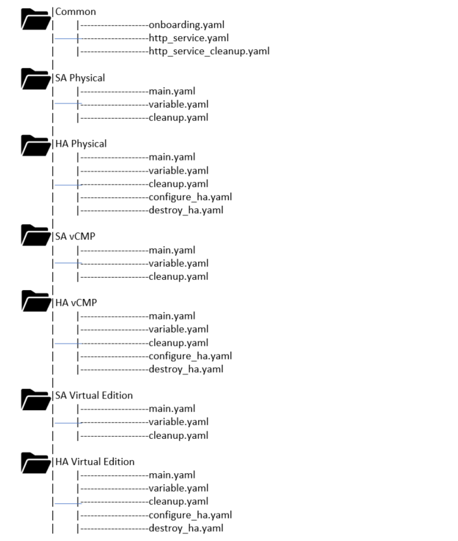{width="4.145472440944882in"
height="4.896174540682415in"}

### Sample APIC logical device configuration

#### Logical device configuration for Physical BIG-IP

{width="6.5in" height="2.327777777777778in"}

#### Logical device configuration for vCMP enabled BIG-IP

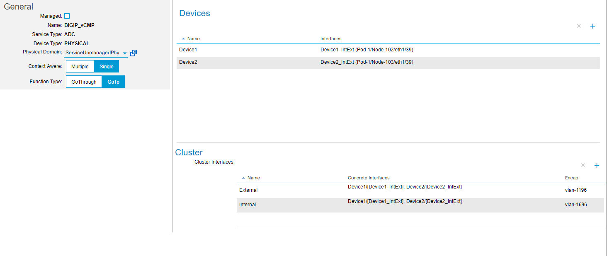{width="6.5in" height="2.74375in"}

#### Logical device configuration for VE of BIG-IP

#### 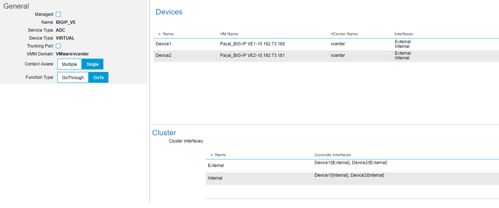{width="6.5in" height="2.7125in"}

Deployment Models
=================

Standalone Physical BIG-IP
--------------------------

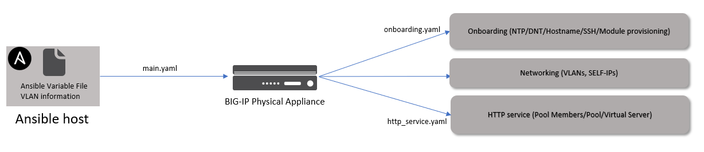{width="6.5in" height="1.4076388888888889in"}

The variable file will contain VLAN tags along with other information.
The VLAN tags should match the VLAN tags configured on APIC in the
logical device cluster. The ansible playbook will only configure the
BIG-IP.

### Variable file

This file will contain all the information needed to configure the
BIG-IP. This variable file is designed to configure the following on the
BIG-IP

-   Onboarding : NTP, DNS, Hostname, SSH settings, Module provisioning
-   Networking: 2 VLAN's, 2 Self-IP's, SNAT
    -   This represents a 2 ARM mode BIG-IP connection to the APIC
        -   Same interface on the BIG-IP will be used for client and
            server traffic
        -   Separate VLAN for client and server traffic is tagged on the
            BIG-IP interface
    -   SNAT is set to none (Assumption: Backend servers have the BIG-IP
        as their default gateway)
-   HTTP service: Pool members, Pool, Virtual Server

```
onboarding: "yes"                                   Do you want to onboard the BIG-IP - Options: yes/no
banner_text: "--Standalone BIG-IP UnManaged ---"    SSH banner text
	
hostname: 'bigip.local'	                            Hostname of the BIG-IP (Part of onboarding)
	
ntp_servers:	                                    NTP servers to be configured (Part of onboarding)
 - '172.27.1.1'	
 - '172.27.1.2'	
	
dns_servers:	                                    DNS servers to be configured (Part of onboarding)
 - '8.8.8.8'	
 - '4.4.4.4'	
ip_version: 4	
	
module_provisioning:	                            Modules to be provisioned on BIG-IP (Part of onboarding)
 - name: 'ltm'	
   level: 'nominal'	
	
tenant_name_aci: "UM_F5_Tenant"	                    APIC tenant name
ldev_name_aci: "BIGIP_PHY"	                    APIC logical device cluster name
	
	
bigip_ip: 10.192.73.91	                            BIG-IP credentials
bigip_username: "admin"	
bigip_password: "admin"	
	
vlan_information:                                   VLAN to be added to BIG-IP
- name: "External_VLAN"                             VLAN’s match what is present in the logical device cluster BIGIP_PHY
  id: "1195"
  interface: "2.2"
- name: "Internal_VLAN"
  id: "1695"
  interface: "2.2"
	   
static_route:	                                    Add a static route
- name: "default"
  gw_address: "10.168.56.1"
  destination: "0.0.0.0"
  netmask: "0.0.0.0"
  
bigip_selfip_information:                           Self-IP to be added to BIG-IP, tag the appropriate VLAN to the respective Self-IP
- name: 'External-SelfIP'
  address: '10.168.68.10'
  netmask: '255.255.255.0'
  vlan: "{{vlan_information[0]['name']}}"
- name: 'Internal-SelfIP'
  address: '192.168.68.10'
  netmask: '255.255.255.0'
  vlan: "{{vlan_information[1]['name']}}"	
  
service: "yes"	                                    Do you want to configure HTTP service on the BIG-IP -Options: yes/no
	
vip_name: "http_vs"	                            VIP information (Part of configuring HTTP service)
vip_port: "80"	
vip_ip: "10.168.68.105"
	
snat: "None"                                        Options: ‘None/Automap/snat-pool name’
pool_name: "web-pool"	                            Pool Information (Part of configuring HTTP service)
pool_members:	
- port: "80"	
  host: "192.168.68.140"	
- port: "80"	
  host: "192.168.68.141"	

```

### 

If a different scenario is needed to be configured, for example BIG-IP
in one arm mode, then the variable file will need to be modified
accordingly. The onboarding and http service sections will remain the
same.

-   VLAN and Self-IP -- only 1 entry will be needed
-   SNAT: Automap can be used
-   Example of the changes in the variable file

```
vlan_information:
- name: "External_VLAN"
  id: "1195"
  interface: "2.2”

bigip_selfip_information:
- name: 'External-SelfIP'
  address: '10.168.68.10'
  netmask: '255.255.255.0'
  vlan: "{{vlan_information[0]['name']}}"

snat: "Automap"
```
### Playbook

The main.yaml playbook will be executed. Sequence of events

-   If onboarding is set to 'yes' then the onboarding.yaml playbook will
    be executed
-   Network constructs will be configured on the BIG-IP
    -   The name of the VLAN and SELF-IP will tie it to an APIC tenant
-   If service is set to 'yes' then the http\_service.yaml playbook will
    be executed
    -   The name of the virtual server will tie it to an APIC tenant and
        LDEV

**Command to execute playbook**
-   ansible-playbook main.yaml

**Main.yaml**
```
- name: SA Physical Unmanaged Mode BIG-IP setup	
  hosts: localhost	
  connection: local	
  gather_facts: false	
	
  vars_files:						Include the variable file above
    - variable.yaml	
	
  tasks:	
	
  - include_tasks: ../common/onboarding.yaml		Onboarding playbook will be executed 
    when: '"yes" in onboarding '	
	
  - name: Add VLAN(s)					VLAN(s) will be added
    bigip_vlan:	
      server: "{{bigip_ip}}"	
      user: "{{ bigip_username }}"	
      password: "{{ bigip_password }}"	
      name: "{{tenant_name_aci}}_{{item.name}}"		Name will tie it to a APIC tenant
      tag: "{{item.id}}"	
      tagged_interfaces:				Interface will be tagged
      - "{{item.interface}}"	
      validate_certs: "no"	
    with_items: "{{vlan_information}}"	
	
  - name: Add SELF-IP(s)				Self-IP will be added
    bigip_selfip:	
     server: "{{bigip_ip}}"	
     user: "{{ bigip_username }}"	
     password: "{{ bigip_password }}"	
     name: "{{tenant_name_aci}}_{{item.name}}"		Name will tie it to a APIC tenant
     address: "{{item.address}}"	
     netmask: "{{item.netmask}}"	
     vlan: "{{tenant_name_aci}}_{{item.vlan}}"	
     validate_certs: "no"	
    with_items: "{{ bigip_selfip_information }}"	

- name: Add route(s)
    bigip_static_route:
      server: "{{bigip_ip}}"
      user: "{{ bigip_username }}"
      password: "{{ bigip_password }}"
      name: "{{item.name}}"
      gateway_address: "{{item.gw_address}}"
      netmask: "{{item.netmask}}"
      destination: "{{item.destination}}"
      validate_certs: "no"
    with_items: "{{static_route}}"
    delegate_to: localhost
	
  - include_tasks: ../common/http_service.yaml		Service (VIP/Pool/Members) playbook will be executed
    when: '"yes" in service '	

```

After running the playbook login to the BIG-IP and check all the objects
are configured

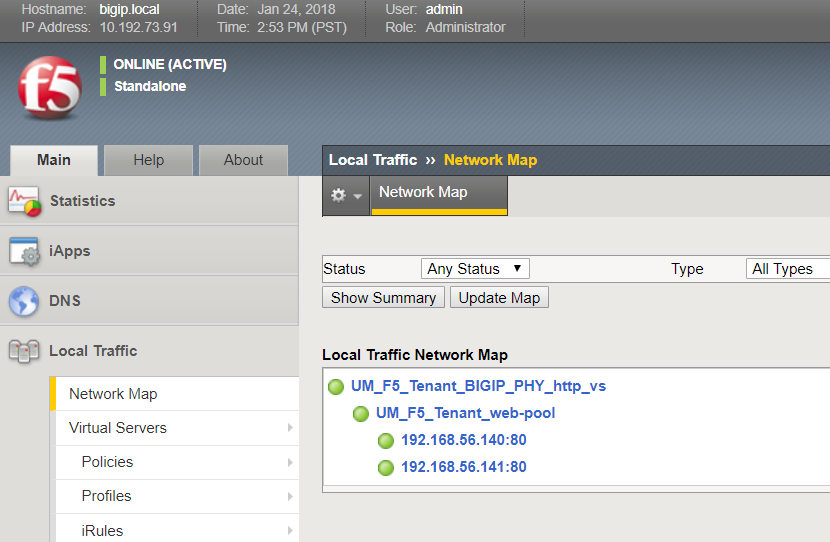{width="6.5in" height="4.2444444444444445in"}

To perform a cleanup of the BIG-IP configuration, run the following
playbook:

-   ansible-playbook cleanup.yaml

This will remove all the objects configured by the above playbook (VS/pools/nodes/Self-IPs/VLANS)

HA Physical BIG-IP
------------------

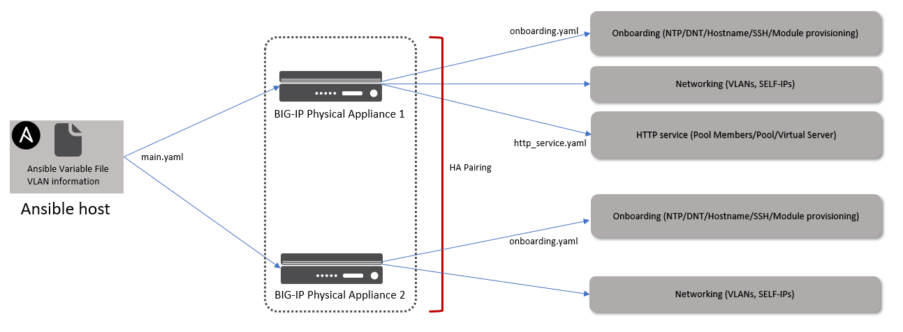{width="6.5in" height="2.3979166666666667in"}

The playbook along with configuration as done on the standalone physical
setup will also configure

-   HA setup between the two BIG-IP's
-   Onboarding tasks on both BIG-IP's
-   Floating-IP(s) setup on the BIG-IP

[Click here for scripts](http://google.com)

### Variable file

Variable file will have additional information needed to setup the
BIG-IP HA pair

### Playbook

The main.yaml playbook will be executed. Sequence of events

-   If onboarding is set to 'yes' then the onboarding.yaml playbook will
    be executed on both BIG-IPs
-   HA pairing will be configured
-   Network constructs will be configured on the both the BIG-IPs
    -   The name of the VLAN and SELF-IP will tie it to an APIC tenant
-   If service is set to 'yes' then the http\_service.yaml playbook will
    be executed on one BIG-IP (configuration will be synced
    automatically between the pair of BIG-IPs)
    -   The name of the virtual server will tie it to an APIC tenant and
        LDEV

After running the playbook login to both the BIG-IP and that check all
the objects are configured and HA pairing has been done.

{width="5.167113954505687in"
height="3.850333552055993in"}

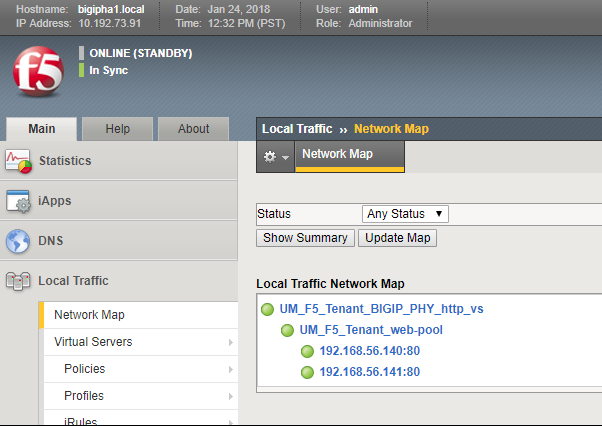{width="5.158470034995625in"
height="3.6503444881889764in"}

To perform a cleanup of the BIG-IP configuration, run the following
playbook:

-   ansible-playbook cleanup.yaml

This will remove all the objects configured by the above playbook (VS/pools/nodes/Self-IPs/VLANS). It will also remove all the objects
that setup HA (HA pairing will be destroyed)

SA vCMP BIG-IP
--------------

{width="6.5in" height="2.745138888888889in"}

The variable file will contain VLAN tags along with other information.
The VLAN tags should match the VLAN tags configured on APIC in the
logical device cluster. The ansible playbook will only configure the
BIG-IP.

[Click here for scripts](http://google.com)

### Variable file

This file will contain all the information needed to configure the
BIG-IP. This variable file is designed to configure the following on the
BIG-IP

-   Onboarding the vCMP guest : NTP, DNS, Hostname, SSH settings, Module
    provisioning
-   VLAN's, added to the vCMP host
-   VLAN's assigned from the vCMP host to the vCMP guest
-   2 Self-IP's, SNAT on the vCMP guest
    -   This represents a 2 ARM mode BIG-IP connection to the APIC
        -   VLAN is tagged on a BIG-IP interface
    -   SNAT is set to none (Assumption: Backend servers have the BIG-IP
        as their default gateway)
-   HTTP service: Pool members, Pool, Virtual Server on the vCMP guest

### Playbook

The main.yaml playbook will be executed. Sequence of events

-   If onboarding is set to 'yes' then the tasks in the onboarding.yaml
    playbook will be executed on the vCMP guest
-   Network constructs will be configured on the BIG-IP
    -   VLAN will be configured on the vCMP host and then assigned to
        the vCMP guest
    -   SELF-IP will tie it to an APIC tenant
-   If service is set to 'yes' then the http\_service.yaml playbook will
    be executed
    -   The name of the virtual server will tie it to an APIC tenant and
        LDEV

**Command to execute playbook**

-   ansible-playbook main.yaml

After running the playbook login to both the vCMP host and guest and check all the objects are configured

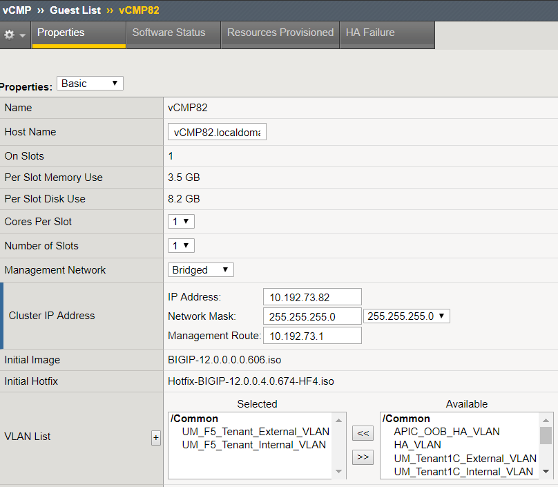{width="5.510076552930884in"
height="4.808926071741032in"}

{width="5.510076552930884in"
height="4.808926071741032in"}

{width="5.510076552930884in"
height="4.808926071741032in"}

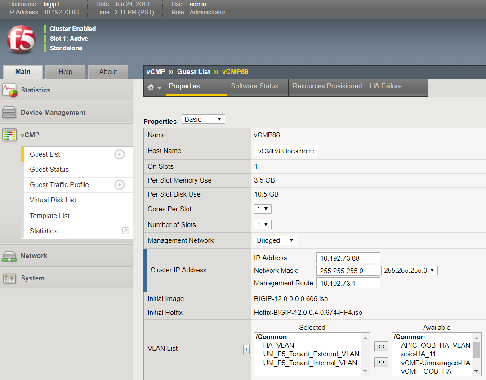{width="5.510076552930884in"
height="4.808926071741032in"}

To perform a cleanup of the BIG-IP configuration, run the following
playbook:

-   ansible-playbook cleanup.yaml

This will remove all the objects configured by the above playbook on the vCMP guest (VS/pools/nodes/Self-IPs/VLANS). It will also remove
objects configured on the vCMP host

HA vCMP BIG-IP
--------------

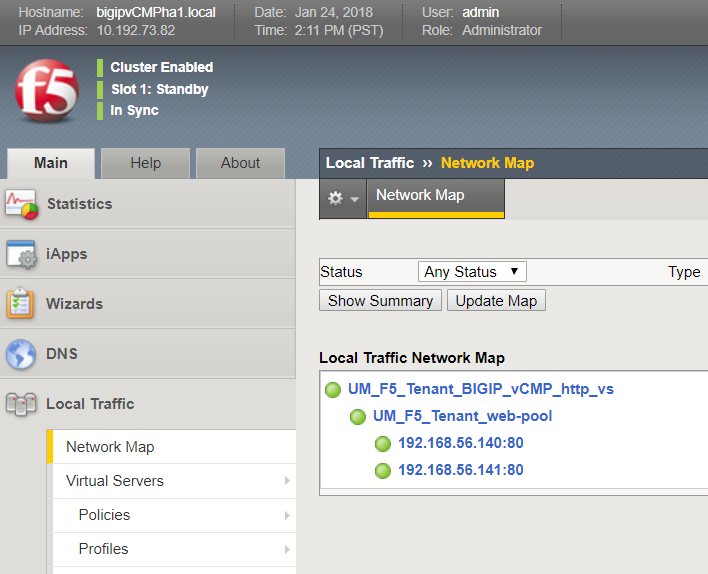{width="6.5in" height="2.7215277777777778in"}

The variable file will contain VLAN tags along with other information.
The VLAN tags should match the VLAN tags configured on APIC in the
logical device cluster. The ansible playbook will only configure the
BIG-IP.

[Click here for scripts](http://google.com)

### Variable file

This file will contain all the information needed to configure the
BIG-IP. This variable file is designed to configure the following on the
BIG-IP

-   Onboarding the vCMP guest : NTP, DNS, Hostname, SSH settings, Module
    provisioning
-   VLAN's, added to the vCMP host
-   VLAN's assigned from the vCMP host to the vCMP guest
-   2 Self-IP's, SNAT on the vCMP guest
    -   This represents a 2 ARM mode BIG-IP connection to the APIC
        -   VLAN is tagged on a BIG-IP interface
    -   SNAT is set to none (Assumption: Backend servers have the BIG-IP
        as their default gateway)
-   HTTP service: Pool members, Pool, Virtual Server on the vCMP guest

\<\<To view all the files for this scenario, refer to link \<\<\>\> \>\>

### Playbook

The main.yaml playbook will be executed. Sequence of events

-   If onboarding is set to 'yes' then the tasks in the onboarding.yaml
    playbook will be executed on the vCMP guest
-   HA pairing between the vCMP guests will be configured
-   Network constructs will be configured on the BIG-IP
    -   VLAN will be configured on the vCMP host and then assigned to
        the vCMP guest
    -   SELF-IP will tie it to an APIC tenant
-   If service is set to 'yes' then the http\_service.yaml playbook will
    be executed
    -   The name of the virtual server will tie it to an APIC tenant and
        LDEV

**Command to execute playbook**

-   ansible-playbook main.yaml

After running the playbook login to both the vCMP hosts and guests and check all the objects are configured

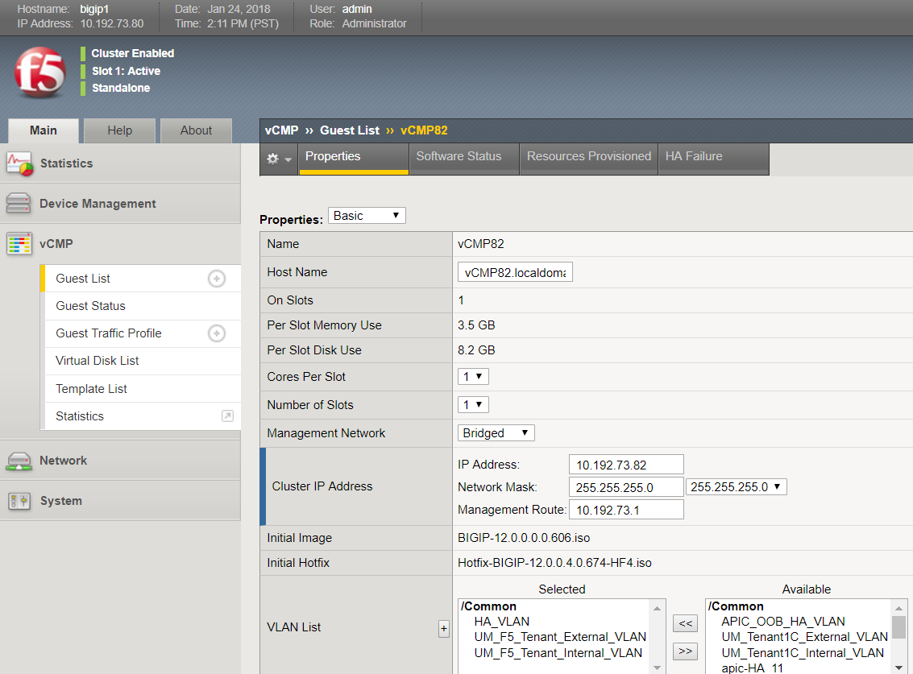{width="5.510076552930884in"
height="4.808926071741032in"}

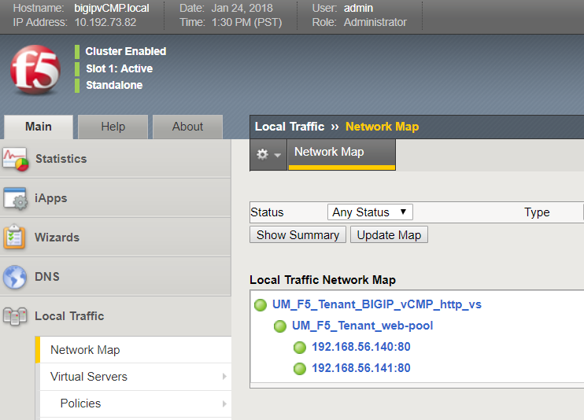{width="5.510076552930884in"
height="4.808926071741032in"}

{width="5.510076552930884in"
height="4.808926071741032in"}

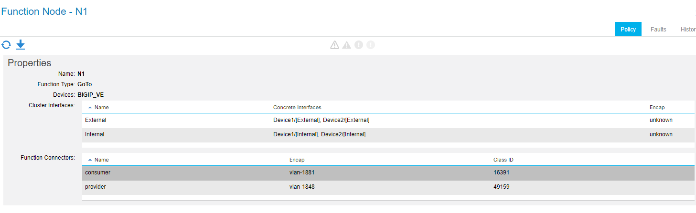{width="5.510076552930884in"
height="4.808926071741032in"}

To perform a cleanup of the BIG-IP configuration, run the following
playbook:

-   ansible-playbook cleanup.yaml

This will remove all the objects configured by the above playbook on the vCMP guest (VS/pools/nodes/Self-IPs/VLANS). It will also remove
objects configured on the vCMP host. HA pairing will also be destroyed

SA Virtual Edition BIG-IP
-------------------------

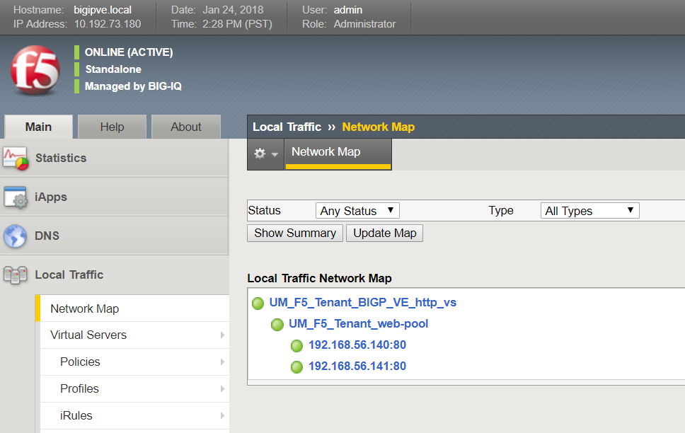{width="6.5in" height="1.5986111111111112in"}

The variable file will contain VLAN tags along with other information.
The VLAN tags should match the VLAN tags assigned by APIC once the
service graph is deployed. The ansible playbook will only configure the
BIG-IP.

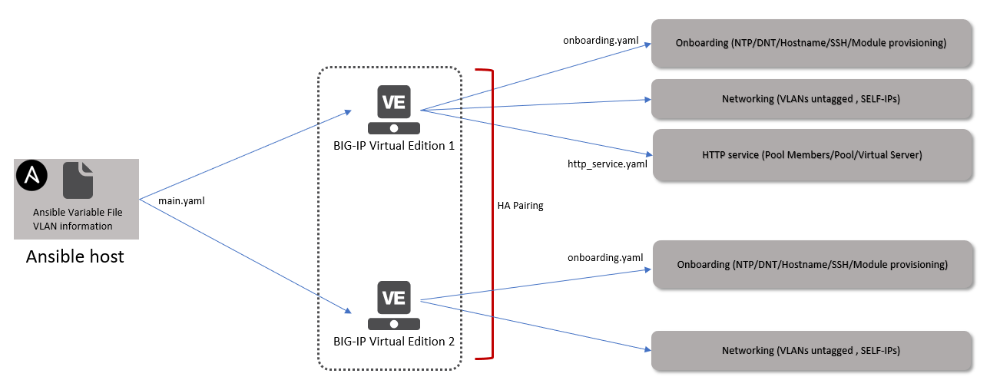{width="6.5in" height="1.9944444444444445in"}

[Click here for scripts](http://google.com)

### Variable file

This file will contain all the information needed to configure the
BIG-IP. This variable file is designed to configure the following on the
BIG-IP

-   Onboarding the vCMP guest : NTP, DNS, Hostname, SSH settings, Module
    provisioning
-   Networking: VLAN's, Self-IPs
-   HTTP service: Pool members, Pool, Virtual Server

### Playbook

The main.yaml playbook will be executed. Sequence of events
-   If onboarding is set to 'yes' then the tasks in the onboarding.yaml
    playbook will be executed
-   Network constructs will be configured on the BIG-IP (VLAN and
    Self-IP)
    -   The VLAN will be untagged on the respective interface
-   If service is set to 'yes' then the http\_service.yaml playbook will
    be executed
    -   The name of the virtual server will tie it to an APIC tenant and
        LDEV

**Command to execute playbook**

-   ansible-playbook main.yaml

After running the playbook login to the BIG-IP and check all the objects are configured

{width="6.5in" height="4.1097222222222225in"}

To perform a cleanup of the BIG-IP configuration, run the following
playbook:

-   ansible-playbook cleanup.yaml

This will remove all the objects configured by the above playbook (VS/pools/nodes/Self-IPs/VLANS)

HA Virtual Edition BIG-IP
-------------------------

{width="6.5in" height="2.536111111111111in"}

The variable file will contain VLAN tags along with other information.
The VLAN tags should match the VLAN tags assigned by APIC once the
service graph is deployed. The ansible playbook will only configure the
BIG-IP.

{width="6.5in" height="1.9944444444444445in"}

The playbook along with configuration as done on the standalone VE setup
will also configure

-   HA setup between the two BIG-IP's
-   Onboarding tasks on both BIG-IP's
-   Floating-IP(s) setup on the BIG-IP

[Click here for scripts](http://google.com)

### Variable file

Variable file will have additional information needed to setup the
BIG-IP HA pair

### Playbook

The main.yaml playbook will be executed. Sequence of events

-   If onboarding is set to 'yes' then the onboarding.yaml playbook will
    be executed on both BIG-IPs
-   HA pairing will be configured
-   Network constructs will be configured on the both the BIG-IPs
    -   The name of the VLAN and SELF-IP will tie it to an APIC tenant
-   If service is set to 'yes' then the http\_service.yaml playbook will
    be executed on one BIG-IP (configuration will be synced
    automatically between the pair of BIG-IPs)
    -   The name of the virtual server will tie it to an APIC tenant and
        LDEV

After running the playbook login to both the BIG-IP and that check all the objects are configured and HA pairing has been done.

{width="5.510076552930884in"
height="4.808926071741032in"}

{width="5.510076552930884in"
height="4.808926071741032in"}

{width="5.510076552930884in"
height="4.808926071741032in"}

{width="5.510076552930884in"
height="4.808926071741032in"}

To perform a cleanup of the BIG-IP configuration, run the following
playbook:

-   ansible-playbook cleanup.yaml

This will remove all the objects configured by the above playbook (VS/pools/nodes/Self-IPs/VLANS). It will also remove all the objects
that setup HA (HA pairing will be destroyed)
